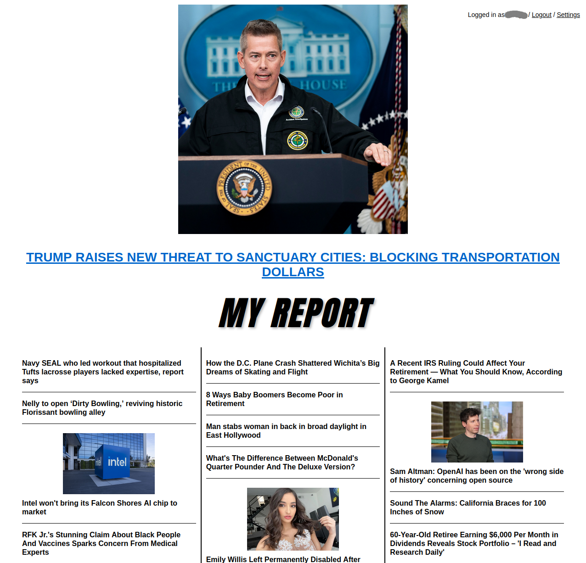
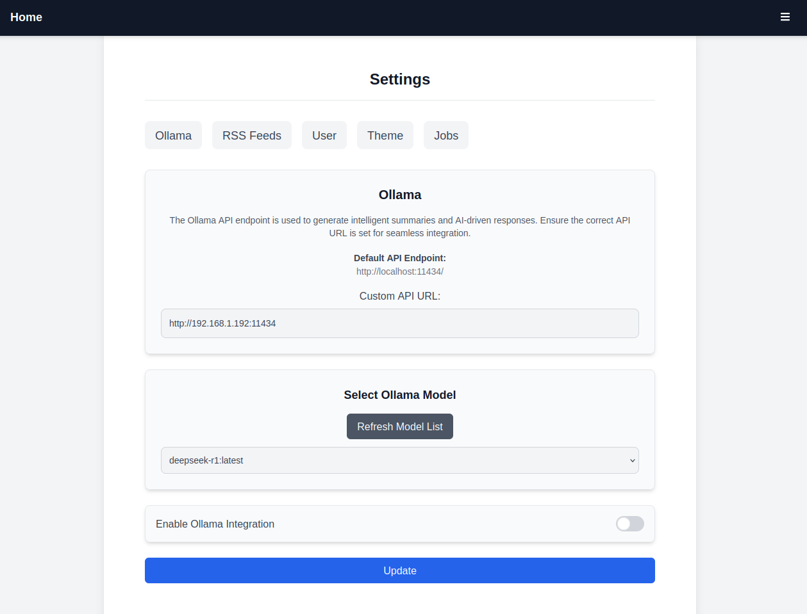

**THIS IS AN ONGOING PROJECT - EXPECT BREAKING CHANGES**

# Drudge-Report-Flask

Here is an example of the interface:


Here is an example of the interface


Here is an example of the Settings

**Drudge-Report-Flask** is a **Flask-based replica** of The Drudge Report, built to showcase news aggregation, real-time content display, and responsive web design. This project is containerized using Docker and Docker Compose, with a SQLite database to store articles and user data.

## Features

- News aggregation (similar to The Drudge Report)
- Responsive and minimalistic design
- Built with Flask and SQLite
- Dockerized for easy deployment
- Simple content management (articles, updates, etc.)
- Admin Section

## Tech Stack

- **Backend**: Flask (Python web framework)
- **Database**: SQLite (stored in `news.db`)
- **Containerization**: Docker, Docker Compose
- **Web Server**: Gunicorn (for production deployment)
- **Frontend**: HTML, CSS, and simple templates

## Installation

### Prerequisites

Ensure that you have the following installed on your local machine:

- [Docker](https://www.docker.com/products/docker-desktop)
- [Docker Compose](https://docs.docker.com/compose/install/)

### Clone the Repository

```bash
git clone https://github.com/kaspaeve/Drudge-Report-Flask.git
cd Drudge-Report-Flask
```

### Build and Run with Docker Compose

To build and run the project using Docker Compose, simply use the following command:

```bash
docker-compose up --build
```

This will:

- Clone the latest code from GitHub
- Build the Docker image
- Set up and run the Flask application using Gunicorn
- Expose the app on port 5000

Visit [http://localhost:5000](http://localhost:5000) to access the site.

### Running Without Docker (Optional)

If you'd prefer to run the project without Docker, you can follow these steps:

1. Install the dependencies using pip:
   ```bash
   pip install -r requirements.txt
   ```

2. Run the Flask application:
   ```bash
   python app.py
   ```

3. Visit [http://localhost:5000](http://localhost:5000) to access the site.

## Usage

- **Homepage**: Displays the latest aggregated news links.
- **Admin Panel**: Allows for simple content management (add, remove, or update news).
  
You can modify the `news.db` file to change the content displayed, or update the articles from within the app.

## Upcoming Features

Ollama is being implemented for **future cards** that will provide **summaries** when you hover over a link. This will enhance the user experience by providing quick summaries of articles directly within the interface.

## Contributing

1. Fork this repository.
2. Create a new branch (`git checkout -b feature-name`).
3. Commit your changes (`git commit -am 'Add new feature'`).
4. Push to the branch (`git push origin feature-name`).
5. Open a pull request to merge your changes into the main branch.